# Table of Contents
- [Bill of Materials (BOM)](#bom)
- [Tools](#tools)
- [SD Card Preparation](#sd-card-preparation)
- [Initial System Setup](#initial-system-setup)
  - [Update All the Things](#update-all-the-things)
  - [Install RetroPie](#install-retropie)
- [RetroPie Setup](#retropie-setup)
- [ROMS and Scraper](#roms-and-scraper)
- [SNES Controller Modifications](#snes-controller-modifications)
  - [Clean Up](#clean-up)
  - [Modify Shell for HDMI Adapter](#modify-shell-for-the-hdmi-adapter)
  - [Modify Shell for Power Supply](#modify-shell-for-the-power-supply-and-power-button)
- [Connect SNES Board to Zero GPIO](#connect-the-snes-board-to-the-zero-gpio)
- [Configure SNES Controller](#configure-snes-controller-with-gamecon-drivers)
- [Final Assembly](#final-assembly)
- [TODO](#todo)
- [Credits](#credits)

# BOM

I went for assortments when available, gotta stock up for later projects, you can find single switches or heatsinks but then they are much more expensive.

- [Raspberry Pi Zero W](https://a.co/d/9t5E3CI)
- [128GB+ SD Card](https://a.co/d/akqkm5l)
- [Original SNES / Super Famicom SNS-005 controller](https://www.ebay.com/sch/i.html?_nkw=snes+controller+sns-005&_sop=12)
- [Mini HDMI to HDMI Adapter](https://a.co/d/fsexFbT)
- [2 X 500mAh 1S lithium battery](https://a.co/d/gIMMhuZ)
- [5V Boost Converter / Battery charger](https://a.co/d/5gvOEu1)
- [6X6X7 Momentary push button](https://a.co/d/fakr7Ya)
- [30 AWG silicon stranded wire](https://www.raspberrypi.com/software/)
- [Kapton tape](https://a.co/d/53CbDAP)
- [3M VHB Tape](https://a.co/d/eFQhAup)

# Tools

Small Phillips head screwdriver and soldering supplies. At least a temperature controlled iron and 60/40 leaded solder.

Dremel, X-Acto knifes and cutters.

# SD Card preparation

I had a few different issues if I used the RetroPie image. So we will start on a vanilla pi OS install and install RetroPie using their setup script.

Download the latest [Raspberry Pi Imager](https://www.raspberrypi.com/software/).

Choose **Raspberry Pi Zero 2 W** as **Device**, **Raspberry Pi OS Lite(64-bit)** for the **OS**, then pick your **SD card** for the **storage** and hit next.

Edit the settings as you see fit. I would advise to set a cool **hostname**, keep **pi** as the **username** and set your **WiFi** credentials and **locale settings**. Don't forget in **services** to enable **SSH**.

Once the card is ready insert it into the Zero and plug in a micro USB in the power port, furthest away from the hdmi port.

# Initial system setup

`ssh pi@mycoolhostname.local` and let's start configuring.

## Update all the things

`sudo apt update && sudo apt -y dist-upgrade` will get the Raspberry Pi OS Lite up to date.

`sudo raspi-config`

**Update** the tool to it's latest version then choose **Localisation Options** > **Locale**.

You should be **unchecking** **en_GB.UTF-8 UTF-8** and checking **en_US.UTF-8 UTF-8** using the space bar.

Choose **en_US.UTF-8** as the default locale for the system environment.

`sudo reboot` to make sure those apply.

Now we fix the missing locales, this is important when building from source later on.

```bash
sudo update-locale LANGUAGE="en_US:en" && sudo update-locale LC_ALL=en_US.UTF-8

sudo reboot
```

We can check that the locale is properly set after a reboot:

```bash
$ locale
LANG=en_US.UTF-8
LANGUAGE=en_US:en
LC_CTYPE="en_US.UTF-8"
LC_NUMERIC="en_US.UTF-8"
LC_TIME="en_US.UTF-8"
LC_COLLATE="en_US.UTF-8"
LC_MONETARY="en_US.UTF-8"
LC_MESSAGES="en_US.UTF-8"
LC_PAPER="en_US.UTF-8"
LC_NAME="en_US.UTF-8"
LC_ADDRESS="en_US.UTF-8"
LC_TELEPHONE="en_US.UTF-8"
LC_MEASUREMENT="en_US.UTF-8"
LC_IDENTIFICATION="en_US.UTF-8"
LC_ALL=en_US.UTF-8
```

Run this command as it will be helpful later not to hang boot because of a lack of networking:

```bash
sudo systemctl stop NetworkManager-wait-online.service
sudo systemctl disable NetworkManager-wait-online.service
```

## Install RetroPie

Start by installing dependencies and also vim, I want vim!

`sudo apt -y install git lsb-release vim`

Now we can clone the RetroPie install script in our home directory

`cd ~/ && git clone --depth=1 https://github.com/RetroPie/RetroPie-Setup.git`

Run the setup script

`sudo ~/RetroPie-Setup/retropie_setup.sh`

On the first run the script will take a bit to install it's dependencies, then ignore warning messages and start a **Basic Install**. Go grab a hot cup of coco and maybe start working on the SNES controller shell, you got a couple hours of compiling to go...

More emulators and scraper:

**Manage optional packages**

**lr-mame2003-plus** for Arcade

**skyscraper** for scraping media and metadata

Once installed, still in skyscraper, select **Configuration / Options**

**Generate Options**

- Enable the *Remove bracket info* option
- Enable the *Use ROM folders for game list & media*

Back out and enable **Download videos**

Exit skyscraper menu.

**Manage experimental packages**

**redream** for Sega Dreamcast

**lr-bettle-saturn** for Sega Saturn

**lr-desmune** for NDS

**lr-opera** for Panasonic 3DO

Once install is done, give it a `sudo reboot` for good measure.

# RetroPie Setup

Now that we have it all installed let's do some configuration.

`sudo ~/RetroPie-Setup/retropie_setup.sh`

Go into **Configuration / tools**.

**bashwelcometweak** and install it.

**bluetooth** select the menu to install dependencies then back out / bind devices.

**consolefont** set to Large for TV screens.

**runcommand** ensure Launch menu art is **Disabled**

**samba** and install samba shares, very useful.

**splashscreen** and download RetroPie-Extra splashscreens, I then picked **dalecoop-snes-controller.jpg** as my splashscreen.

Retropie changed to VLC for x86 and added a script to kill the splashscreen when emulationstation wants to start up.

I want my splash video to not be cut off, so I'd rather es waited. And if we let it start while the video plays, es crashes!

Modify the script that kills the splashscreen process

`sudo vim /etc/profile.d/05-splash.sh`

```bash
PID_FILE=/dev/shm/rp-splashscreen.pid
if [ "`tty`" = "/dev/tty1" ] && [ -z "$DISPLAY" ] && [ -f "$PID_FILE" ]; then
    PID=`cat $PID_FILE`
    while ps -p $PID >/dev/null; do
        sleep 1
    done
    #if ps -p $PID >/dev/null; then
    #    kill $PID >/dev/null 2>&1
    #fi
    rm $PID_FILE
fi
```

Now the script will wait for the splashscreen process to be over rather than killing it.

# ROMS & backups

With Samba shares or scp copy over your roms to `~/RetroPie/roms/`

If making the card from mostly backups:

- Copy the bios to `~/RetroPie/BIOS/`
- Copy splashscreens to `~/RetroPie/splashscreens/`
- Copy using sudo the themes to `/etc/emulationstation/themes/`
- Copy the runcommand splash folders to `/opt/retropie/configs/`
- Copy the bezels to `/opt/retropie/configs/all/retroarch/`
- Copy the tg16 theme toggle to `/opt/retropie/configs/all/retroarch/platforms.cfg` containing `pcengine_theme="tg16"`
- Copy the cache folders `/opt/retropie/configs/all/skyscraper/cache/`

## Scrape metadata

Back in the main skyscraper menu:

**Gather resources** > choose with space your systems and start to cache all metadata
**Generate game list(s)** > choose with space your systems and start to build each gamelist.xml

# Extras

## Hursty Themes

Download the required files and install.

`wget -O - "https://raw.githubusercontent.com/RetroHursty69/HurstyThemes/master/install.sh" | bash`

## BezelProject

Download the required files

```bash
wget https://raw.githubusercontent.com/thebezelproject/BezelProject/master/bezelproject.sh -O ~/RetroPie/retropiemenu/bezelproject.sh

wget https://raw.githubusercontent.com/thebezelproject/BezelProject/master/bezelproject_sastyle.png -O ~/RetroPie/retropiemenu/icons/bezelproject_sastyle.png

chmod +x ~/RetroPie/retropiemenu/bezelproject.sh
```

Edit the gamelist.xml to add this entry with a description and icon
`vim /opt/retropie/configs/all/emulationstation/gamelists/retropie/gamelist.xml`

```xml
<game>
  <path>./bezelproject.sh</path>
  <name>Bezel Project Utility</name>
  <desc>This utility will provide a downloader for Retroarach system bezel packs to be used for various systems within RetroPie.</desc>
  <image>./icons/bezelproject_sastyle.png</image>
</game>
```

`~/RetroPie/retropiemenu/bezelproject.sh`

Run it and install / enable systems. Stick to one style (theme vs system).

If you want the TG16 bezel theme instead of PC Engine edit:

`vim /opt/retropie/configs/pcengine/retroarch.cfg`

And change the overlay to:

`input_overlay = "/opt/retropie/configs/all/retroarch/overlay/NEC-TurboGrafx-16.cfg"`

## Runcommand splash images

Let's install nicer load screens for the retroarch emulators:

```bash
git clone https://github.com/ehettervik/es-runcommand-splash.git

cd es-runcommand-splash && rm -rf .git && rm -rf README.md && cp -r * /opt/retropie/configs/

cd .. && rm -rf es-runcommand-splash
```

## N64 fix

`vim /opt/retropie/configs/all/retroarch-core-options.cfg`

add:

```
parallel-n64-cpucore = "cached_interpreter"
mupen64plus-next-cpucore = "cached_interpreter"
```

## TG16 theme fix

Create this file, if it exists edit it:

`echo 'pcengine_theme="tg16"' > /opt/retropie/configs/all/retroarch/platforms.cfg`

`sudo ~/RetroPie-Setup/retropie_setup.sh`

**Manage packages > Manage main packages > lr-beetle-pce-fast** Re-Install from source.

After an emulationstation restart games will now be under TG16 and not PC Engine.

## Power/Reset button case / soft shutdown mod

If you have a special RetroFlag or other case with buttons or plan to add a soft shutdown to this project.

Before running the install first create the `rc.local` script as it probably doesnt exist.

`sudo vim /etc/rc.local`

```bash
#!/bin/sh
exit 0
```

`sudo chmod +x /etc/rc.local` to make sure it excecutable.

Download and run the install script from [crcerror fork](https://github.com/crcerror/retroflag-picase).

**If you followed along only for the RetroPie setup, enable the autostart of emulationstation at boot**

`sudo ~/RetroPie-Setup/retropie_setup.sh`

Go into **Configuration / tools**.

`autostart` and choose Start Emulation Station at boot.

`sudo poweroff`

**If not keep going it will be enabled later**

# SNES controller modifications

## Clean up

Start by a complete disassembly to clean everything with a toothbrush and hot soapy water. You can try to retrobright the plastics too. A plastic container filled with hydrogen peroxide and your plastic parts inside left outside on a very sunny day can do wonders.

## Modify shell for the HDMI adapter

Start by removing a few plastic posts of the upper shell that are in the way of the Zero or the HDMI adapter.

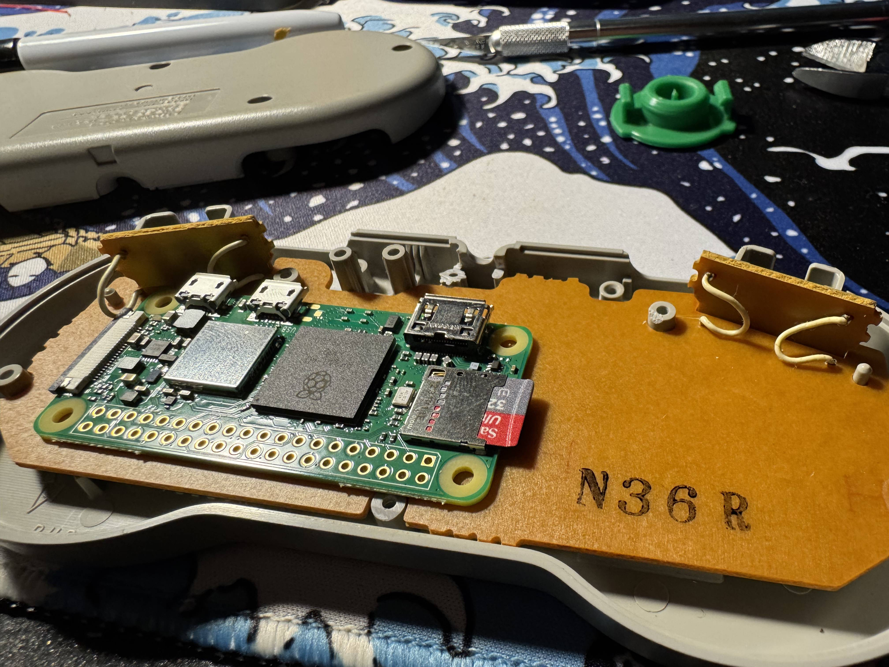

Now line up the HDMI adapter to modify the upper shell by widening the original cord opening until you get a very tight fit, we will fine tune it later.

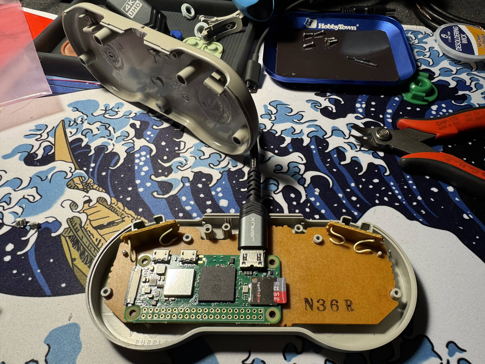

Now remove the plastic posts and supports from the lower shell to match this picture.

**Important:** Note the middle bottom screw post on the lower shell. I made it shorter in that picture but you want to actually remove it completely and use that hole to fit the push button. See next section.

This is when you will line up the bottom shell on top to see how much you need to widen the center cord opening for the HDMI adapter. Make sure you have a solid fit and that the shell can close properly with the Zero and the HDMI adapter.

Note the 4 black sharpie marks to see where the Zero needs to go.

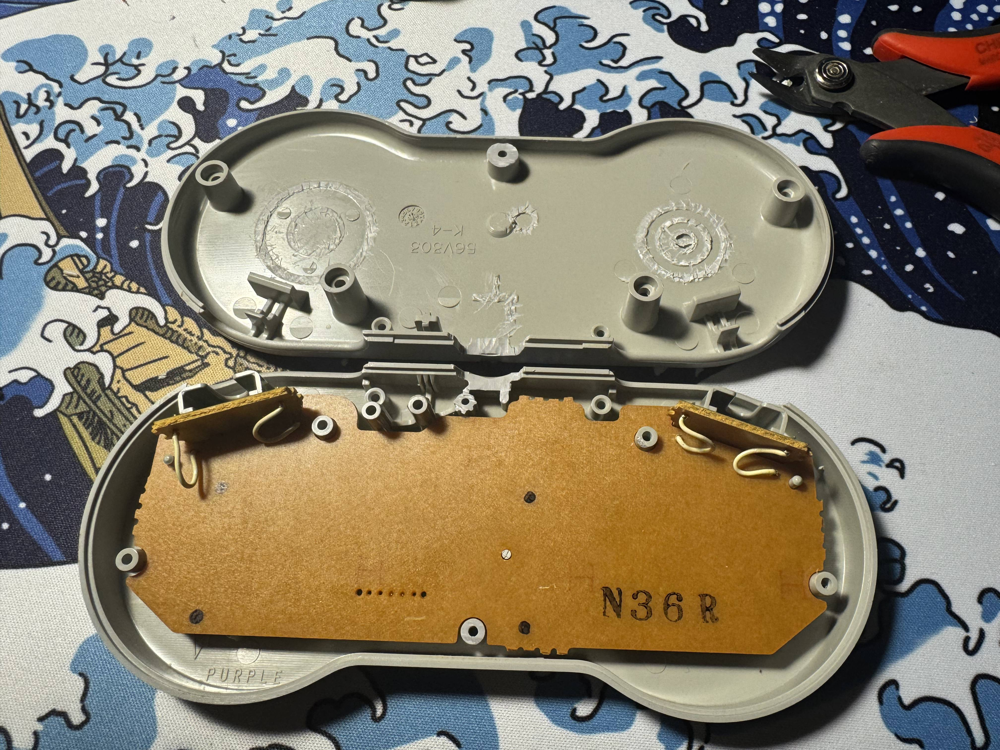

## Modify shell for the power supply and power button

Fit the push button in the hole left by removing the screw post. I used thick CA glue, take care not to glue the button stem in place!

You should also make some slot openings to help ventilate the Pi. Disregard the spacing of mine that is soooo off... OCD triggered but what is done is done!

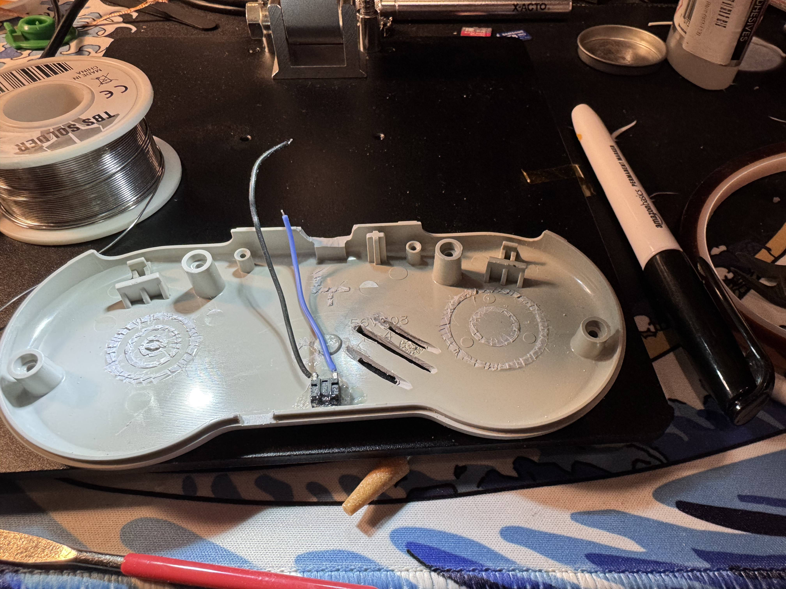
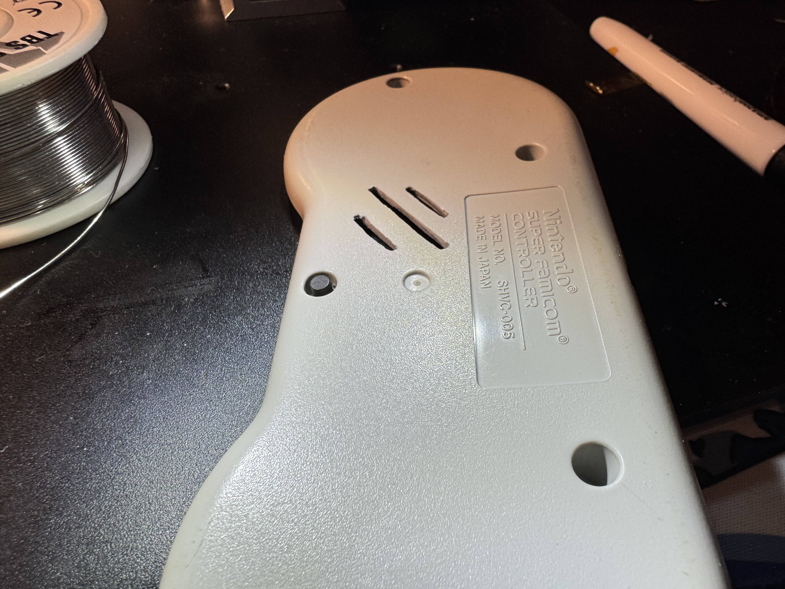

Install the power supply / charger using 3M VHB. If you have the same as mine you want to wire one pin of the push button to the K pad (blue wire) and the other to the 5V output GND (black wire).

Make an opening for the USB port on both parts of the shell.

**DO NOT SOLDER THE BATTERY WIRES YET**

**DO NOT SOLDER THE BATTERY WIRES YET**

The left side battery can be secured in place using 3M VHB tape, but the one on the right is right up against the zero so just make little balls of 3M tape to secure it from the sides, once the shell is closed it can't move anyways.

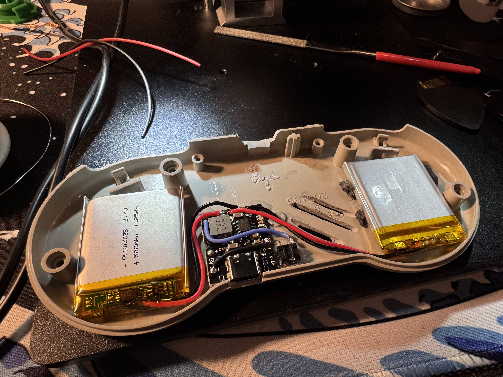

# Connect the SNES board to the Zero GPIO

Remove the stock connector for the SNES cord and solder wires to those pins. Use Kapton tape or CA glue to secure them in place.

Pins for the SNES boards are from left to right: 5V, Clock, Latch, Data, Ground

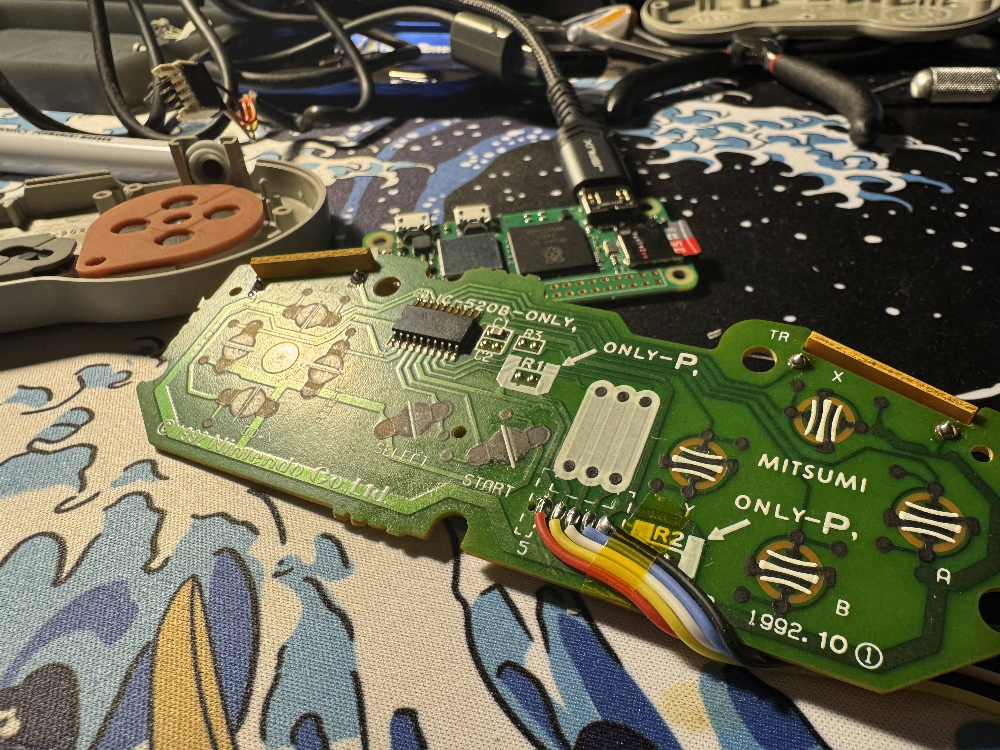

Use 3M VHB to secure the Zero in the location you marked earlier.

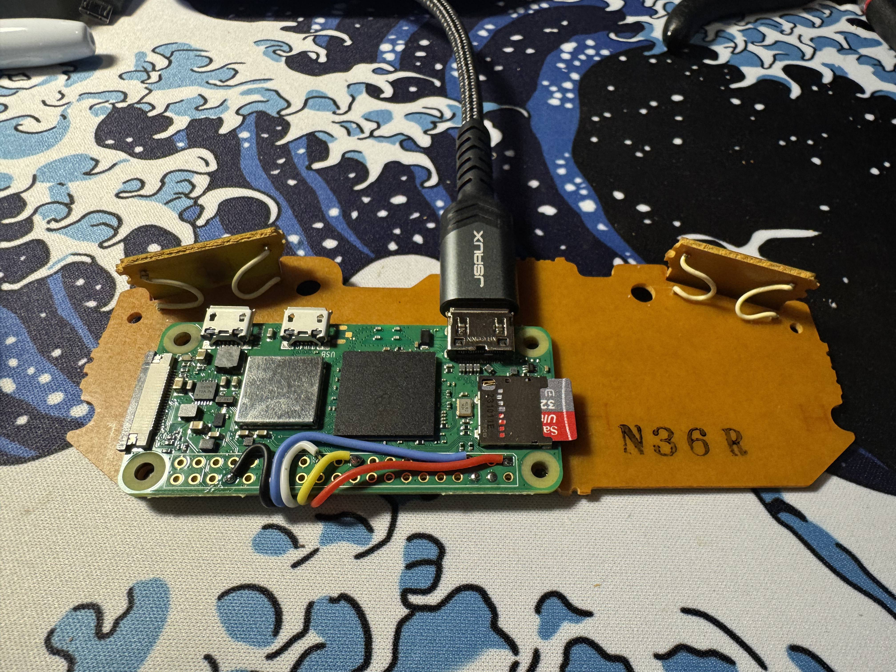

You can refer to this image for the wiring.

Note that it does not mind the 3.3V we will feed it.

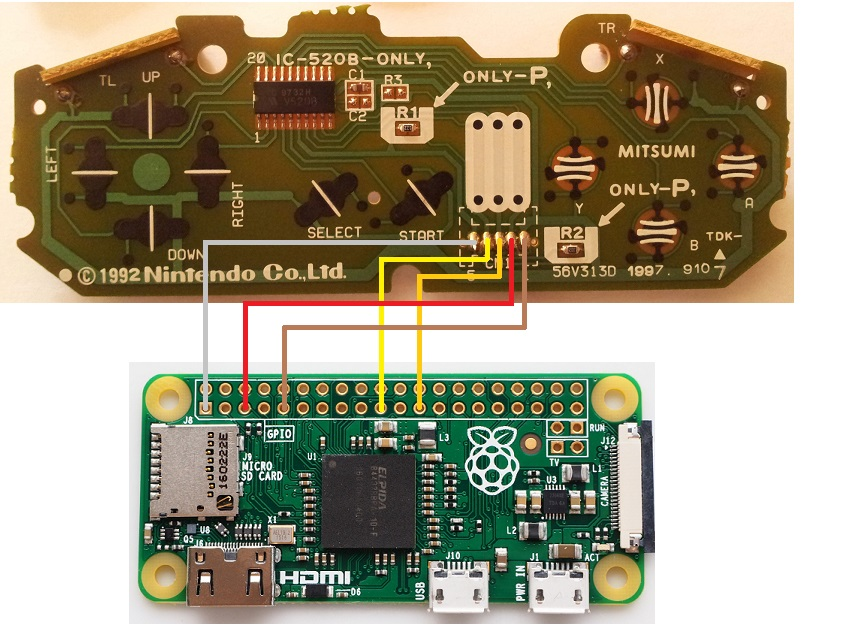

Comparing with the Pi GPIO pinout:

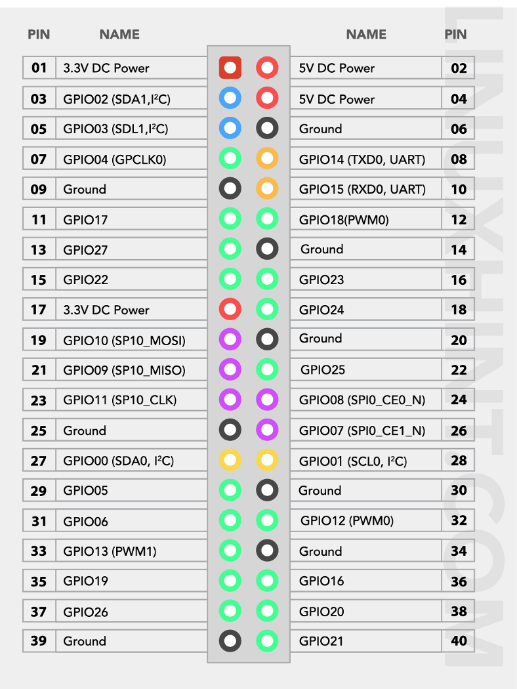

# Configure SNES controller with gamecon drivers

Go back into the RetroPie setup script: `sudo ~/RetroPie-Setup/retropie_setup.sh`

**Manage packages > Manage driver packages > gamecondriver > Install**

`sudo reboot`

Get back into the setup script and configure gamecondriver

`sudo ~/RetroPie-Setup/retropie_setup.sh`

**Configuration / tools > gamecondriver > Configure two SNES controllers**
- Choose **yes** when asked to configure gamecon for 2 SNES controllers.
- Choose **no** when asked to update button mappings for 2 SNES controllers.

The way the **gamecon** drivers work is that the driver will map 6 controllers, each to a different GPIO pin, in that order:

`GPIO0 (pin27), GPIO1 (pin28), GPIO4 (pin7), GPIO7 (pin26), GPIO2 (pin3), GPIO3 (pin5)`

You will need to set the correct controller type in the `/etc/modprobe.d/gamecon.conf` file according to this table:

```
0 = no connection
1 = SNES pad
2 = NES pad
3 = Gamecube pad
6 = N64 pad
7 = PSX/PS2 pad
8 = PSX DDR controller
9 = SNES mouse
```

For us with a SNES controller with it's **data** line connected to **GPIO3 (pin5)** and no other controller connected it translates to: `0,0,0,0,0,1`

So edit `/etc/modprobe.d/gamecon.conf` accordingly:

`sudo vim /etc/modprobe.d/gamecon.conf`

And match this `options gamecon_gpio_rpi map=0,0,0,0,0,1`

We are done with most of the setup, enable the autostart of emulation station at boot

`sudo ~/RetroPie-Setup/retropie_setup.sh`

Go into **Configuration / tools**.

`autostart` and choose Start Emulation Station at boot.

`sudo poweroff`

# Final Assembly

Make sure to remove the SD Card from the Zero as we do not want it to boot when connecting it to power for now.

Connect the 5V output from the PSU to the Zero GPIO pin 4 5V and pin 6 GND.

Connect the two batteries in parallel as such and then cover everything in the bottom shell with Kapton tape.

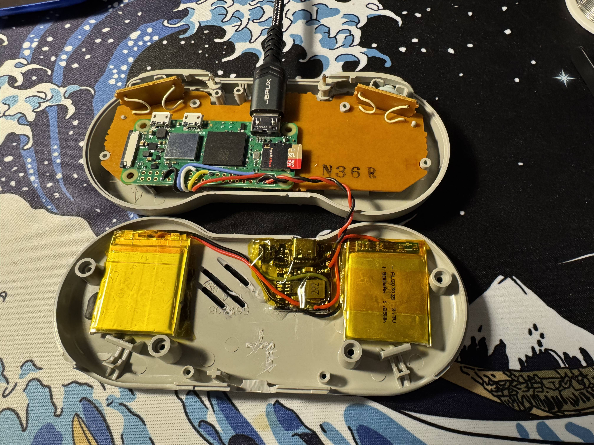

Check for fitment and screw back the shell together, congrats!

One tap of the button wil turn the 5V rail and the Zero on. Once you have safely shutdown the Zero, turn off the power supply with a double tab of the button.

# TODO

[Heatsink kit](https://a.co/d/fNTuxd4)

I haven't tried adding a heatsink on the Zero yet, but there should be enough room above it.

[USB C charger](https://a.co/d/6w4a7ku)

Could try splitting the charger and boost converter for better space management inside.

Add a circuit with a dual mosfet and some diodes to make a soft shutdown and have a 556 dual timer handle the pulses to the K pin of the PSU.

# Credits

[HolyIceCube](https://www.instructables.com/Raspberry-Pi-Powered-SNES-Controller/)

[Anthony Caccese](https://www.youtube.com/watch?v=j5dXx0NhLxg)
